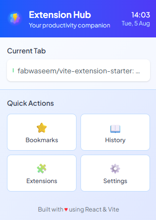

# 🚀 Extension Hub - Browser Extension Starter

A modern, feature-rich browser extension starter built with **React**, **TypeScript**, **Tailwind CSS**, and **Vite**. This project provides a beautiful, production-ready foundation for building cross-browser extensions with a sleek popup interface.

<p align="center">
  
</p>

## ✨ Features

### 🎨 **Modern UI Components**

- **Gradient Header** with real-time clock and date display
- **Current Tab Tracker** showing active browser tab information
- **Quick Actions Grid** with one-click access to browser features
- **Daily Stats Dashboard** with activity metrics
- **Responsive Design** optimized for extension popup dimensions

### 🛠 **Technical Stack**

- **React 18** with TypeScript for type-safe development
- **Tailwind CSS v4** for modern, utility-first styling
- **Vite** for lightning-fast development and building
- **WebExtension Polyfill** for cross-browser compatibility
- **Plus Jakarta Sans** font for beautiful typography

### 🌐 **Cross-Browser Support**

- ✅ Chrome (Manifest V3)
- ✅ Firefox (Manifest V2)
- ✅ Edge and other Chromium-based browsers

## 🏗 Project Structure

```
vite-extension-starter/
├── public/                     # Static assets
│   ├── icon-with-shadow.svg   # Main extension icon
│   └── icon/                  # Icon sizes for manifest
│       ├── 16.png
│       ├── 32.png
│       ├── 48.png
│       ├── 96.png
│       └── 128.png
├── src/
│   ├── pages/
│   │   └── Popup.tsx          # Main popup component
│   ├── background.ts          # Service worker/background script
│   ├── manifest.json          # Extension manifest
│   ├── popup.html            # Popup HTML template
│   ├── popup.tsx             # Popup entry point
│   ├── styles.css            # Global styles with Tailwind
│   └── vite-env.d.ts         # Vite type definitions
├── dist/                      # Built extension (generated)
├── package.json
├── tsconfig.json
├── vite.config.ts
└── README.md
```

## 🚀 Quick Start

### Prerequisites

- Node.js 16+ and npm/pnpm
- Modern web browser (Chrome, Firefox, Edge)

### Installation

1. **Clone or download this repository**

   ```bash
   git clone https://github.com/fabwaseem/vite-extension-starter
   cd vite-extension-starter
   ```

2. **Install dependencies**

   ```bash
   pnpm install
   ```

3. **Build the extension**

   ```bash
   pnpm build
   ```

4. **Load the extension in your browser**

   **For Chrome/Edge:**

   - Open `chrome://extensions/` or `edge://extensions/`
   - Enable "Developer mode"
   - Click "Load unpacked"
   - Select the `dist` folder

   **For Firefox:**

   - Open `about:debugging#/runtime/this-firefox`
   - Click "Load Temporary Add-on"
   - Select any file in the `dist` folder

## 🛠 Development

### Available Scripts

- `pnpm dev` - Start development server with hot reload
- `pnpm build` - Build extension for production

### Development Workflow

1. **Start development mode**

   ```bash
   pnpm dev
   ```

2. **Make your changes** to the source files in `src/`
3. **Build and reload** the extension in your browser to test changes

   ```bash
   pnpm build
   ```

4. **Reload the extension** in browser's extension management page

### Customizing the Popup

The main popup component is located at `src/pages/Popup.tsx`. Key areas to customize:

```tsx
// Update quick actions
const quickActions = [
  { name: "Custom Action", icon: "🎯", action: () => { /* your code */ } },
  // ... more actions
];

// Modify the header
<h1 className="font-bold text-lg">Your Extension Name</h1>

// Add new sections
<div className="p-4">
  {/* Your custom content */}
</div>
```

## 🎯 Key Features Explained

### 1. **Real-time Clock Display**

- Updates every second
- Shows current time and date
- Formatted for readability

### 2. **Active Tab Information**

- Displays current browser tab title
- Uses WebExtension APIs with proper permissions
- Updates when popup opens

### 3. **Quick Actions**

- One-click access to browser features:
  - 🔖 Bookmarks manager
  - 📖 Browsing history
  - 🧩 Extensions page
  - ⚙️ Browser settings

### 4. **Daily Stats (Mock Data)**

- Tabs opened counter
- Active time tracking
- Expandable for real analytics

## 🔧 Configuration

### Adding New Permissions

Edit `src/manifest.json` to add permissions:

```json
{
  "permissions": ["tabs", "storage", "activeTab"]
}
```

### Styling Customization

The project uses Tailwind CSS v4. Customize the theme in `src/styles.css`:

```css
@theme {
  --font-sans: "Your Font", sans-serif;
  --color-primary: #your-color;
}
```

### Browser API Usage

Use the webextension-polyfill for cross-browser compatibility:

```tsx
import browser from "webextension-polyfill";

// Get tabs
const tabs = await browser.tabs.query({ active: true });

// Storage
await browser.storage.local.set({ key: "value" });
```

## 📱 Browser Extension Best Practices

### Performance

- ✅ Lazy load components when possible
- ✅ Minimize bundle size with tree shaking
- ✅ Use efficient React patterns (useCallback, useMemo)

### Security

- ✅ Request minimal permissions
- ✅ Validate all user inputs
- ✅ Use Content Security Policy

### UX Design

- ✅ Keep popup size reasonable (320px width max)
- ✅ Provide visual feedback for actions
- ✅ Follow platform design guidelines

## 🚢 Deployment

### Building for Production

```bash
npm run build
```

The built extension will be in the `dist/` folder, ready for:

- Chrome Web Store submission
- Firefox Add-ons submission
- Manual distribution

### Chrome Web Store Submission

1. Create a ZIP file of the `dist` folder
2. Upload to [Chrome Web Store Developer Dashboard](https://chrome.google.com/webstore/devconsole/)
3. Fill in store listing details
4. Submit for review

### Firefox Add-ons Submission

1. Create a ZIP file of the `dist` folder
2. Upload to [Firefox Add-on Developer Hub](https://addons.mozilla.org/developers/)
3. Complete listing information
4. Submit for review

## 🎨 UI Components Reference

### Color Scheme

- **Primary**: Blue to Indigo gradient (`from-blue-600 to-indigo-600`)
- **Secondary**: Purple to Pink gradient (`from-purple-500 to-pink-500`)
- **Background**: Light blue gradient (`from-blue-50 to-indigo-100`)
- **Accent**: White with blue borders

### Typography

- **Font**: Plus Jakarta Sans (Google Fonts)
- **Sizes**: Text-xs to text-lg for different hierarchy levels
- **Weights**: Regular (400) to Bold (700)

### Interactive Elements

- **Buttons**: Hover effects with scale transforms
- **Cards**: Subtle shadows and border styling
- **Icons**: Emoji-based for universal compatibility

## 🤝 Contributing

1. Fork the repository
2. Create a feature branch (`git checkout -b feature/amazing-feature`)
3. Commit your changes (`git commit -m 'Add amazing feature'`)
4. Push to the branch (`git push origin feature/amazing-feature`)
5. Open a Pull Request

## 📝 License

This project is licensed under the MIT License - see the [LICENSE](LICENSE) file for details.

## 🆘 Troubleshooting

### Common Issues

**Q: Extension doesn't load in Chrome**

- Ensure Manifest V3 compatibility
- Check for console errors in extension popup
- Verify all permissions are correctly set

**Q: TypeScript errors during build**

- Run `npm install` to ensure all dependencies are installed
- Check `tsconfig.json` configuration
- Verify webextension-polyfill types are installed

**Q: Tailwind styles not applying**

- Ensure `@import "tailwindcss"` is in `styles.css`
- Check that PostCSS is configured correctly
- Verify class names are not being purged

**Q: Browser APIs not working**

- Add required permissions to `manifest.json`
- Use `webextension-polyfill` instead of direct `chrome.*` APIs
- Check browser console for permission errors

### Getting Help

- 📖 [WebExtension API Documentation](https://developer.mozilla.org/en-US/docs/Mozilla/Add-ons/WebExtensions)
- 🎨 [Tailwind CSS Documentation](https://tailwindcss.com/docs)
- ⚛️ [React Documentation](https://react.dev)
- 🔧 [Vite Documentation](https://vitejs.dev)

---

**Happy coding! 🎉** Built with ❤️ using modern web technologies.
